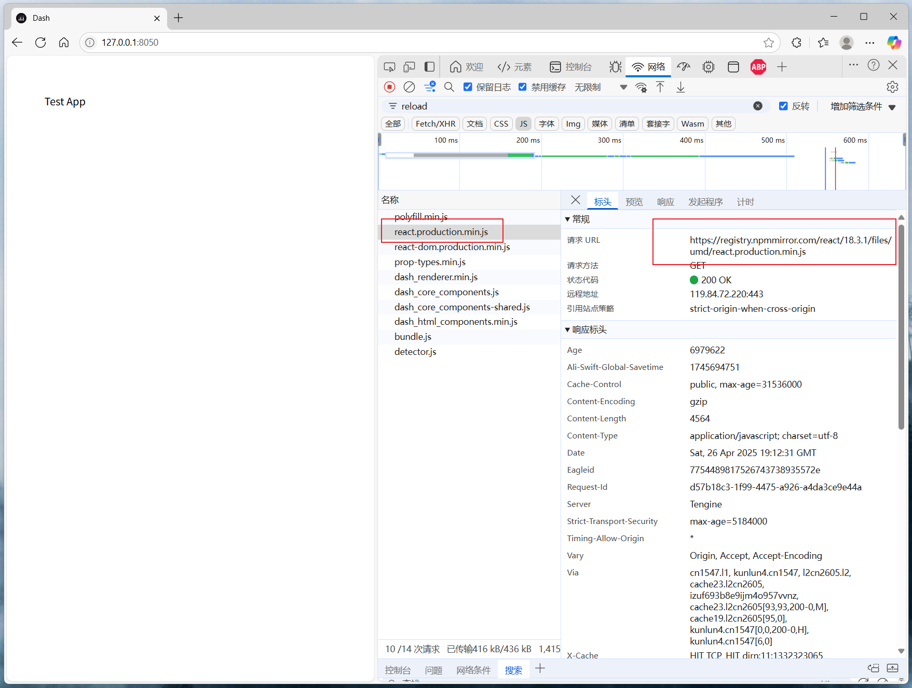

# dash-change-cdn-plugin

[](https://github.com/CNFeffery/dash-change-cdn-plugin/blob/main/LICENSE)
[](https://pypi.org/project/dash-change-cdn-plugin/)
[](https://github.com/astral-sh/ruff)

简体中文 | [English](./README.md)

适用于[Dash](https://github.com/plotly/dash)应用的静态资源 CDN 源切换插件，基于`Dash Hooks`实现，用于将`Dash`应用开启 CDN 后默认的`unpkg`源，快捷更换为`npmmirror`源、`jsdelivr`源以及`fastly-jsdelivr`等常用 CDN。

## 安装

```bash
pip install dash-change-cdn-plugin
```

## 使用

```python
import dash

# 导入插件启用函数
from dash_change_cdn_plugin import setup_change_cdn_plugin

# 为当前应用启用插件
setup_change_cdn_plugin()

# 需要设置serve_locally=False
app = dash.Dash(__name__, serve_locally=False)

# 其他应用代码...
```

## 示例

执行示例应用：

```bash
python example.py
```

<center></center>

## 参数说明

### `setup_change_cdn_plugin()`

用于为当前`Dash`应用启用 CDN 源快捷切换功能。

| 参数         | 类型                                                  | 默认值        | 描述                                                                                      |
| ------------ | ----------------------------------------------------- | ------------- | ----------------------------------------------------------------------------------------- |
| `cdn_source` | `Literal["npmmirror", "jsdelivr", "fastly-jsdelivr"]` | `"npmmirror"` | 设置要切换的目标 CDN 源类型，可选项有： `"npmmirror"`, `"jsdelivr"`, `"fastly-jsdelivr"`. |
